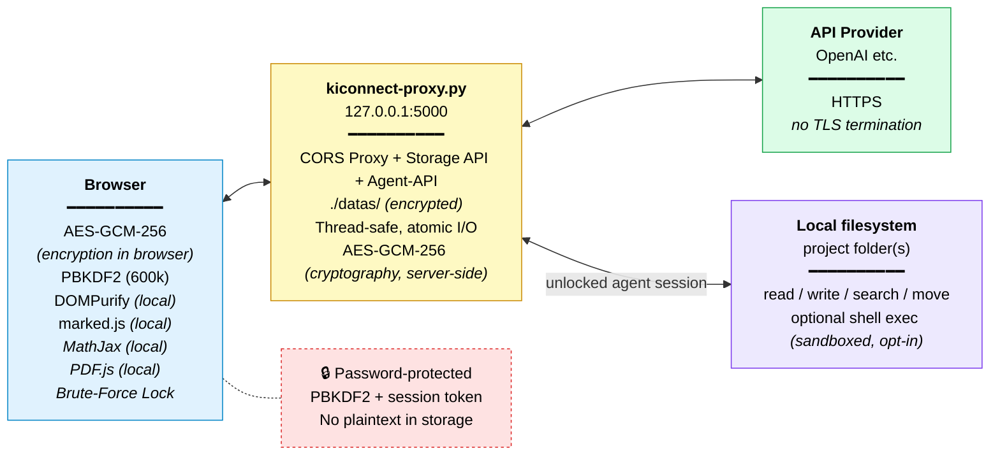

# Ki-Connect - Technical Documentation

This file contains the technical details of Ki-Connect. A general, non-technical introduction can be found in [README.md](README.md).

---

## Overview

Ki-Connect is a locally-run, client-side-encrypted chat client for various AI providers (OpenAI, Anthropic/Claude, OpenRouter, Mistral, Google Gemini, xAI Grok, Groq, DeepSeek, KI Connect NRW, and any OpenAI-compatible server). The underlying application (Python + a web front end) is platform-independent, but this release is packaged and tested for Windows: the provided start scripts (`START.bat`, `START_portable.bat`, `update.bat`) are Windows batch files and will not run as-is on macOS or Linux. The application supports multiple local, separately encrypted accounts on the same installation, which makes it suitable for a small group of trusted users sharing one machine; it is not intended as a multi-tenant deployment for a company with many independent, mutually untrusted users, since all accounts share the same server process and host machine.

---

## Feature summary

- Client-side encryption: all data (chats, profiles, providers, settings) is encrypted with AES-GCM-256 in the browser
- Password-protected multi-account sessions via PBKDF2 (600,000 iterations, random salt per account)
- Brute-force protection: exponential lockout starting at the 5th failed attempt (30s → 60s → 120s → …), not bypassable by clearing the cache
- Browser-independent persistence: data lives in `./datas/` on the local server; any browser (Chrome, Firefox, Edge, …) accesses the same accounts
- Extended Thinking / Reasoning for supported models (Claude 3.7+/4, o1/o3/o4, Grok 3, DeepSeek R1, etc.)
  - Anthropic Claude 4+ (Opus, Sonnet, Haiku): Adaptive Thinking with effort levels (low/medium/high) via the `output_config` API
  - Anthropic Claude 3.7: legacy token budget (1k-32k) plus prompt caching (roughly 90% fewer tokens)
  - OpenAI: reasoning effort (low/medium/high)
- Optional, user-activated web search: when enabled via the web-search toggle in the toolbar, messages are augmented with live web results before being sent to the AI. It is off by default and only runs when the user turns it on (or sets it to "Always")
  - Modes: manual button, Auto (for current-events queries), Always, or Off
  - Free engines (no key required): DuckDuckGo, Startpage, SearXNG, Qwant, Yahoo - with automatic fallback chaining
  - Premium engines (API key required): Brave Search, Google Custom Search, Bing/Azure, Mojeek, Yandex
  - Configurable result count (3-30), 30-minute result cache, locale-aware queries
  - Automatic URL fetching: if the user's message contains links, the page content is fetched and included as context
- Chat organization with folders, drag & drop (chats and folders), and branches
- Image and PDF support (vision models, Ctrl+V paste, PDF text extraction)
- Print function: print the full chat or individual messages (including LaTeX rendering)
- Voice input and output via the Web Speech API (`kiconnect-voice.js`)
  - Dialog mode: the AI reply is read aloud, then the microphone activates again automatically
  - Configurable voice, rate, pitch, and recognition language
- Multilingual interface via `kiconnect-languages-i18n.js`. Currently included:
  - English (en)
  - German (de)
  - French (fr)
  - Spanish (es)
  - Italian (it)
  - Turkish (tr)
  - Russian (ru)
  - Greek (el)
  - Simplified Chinese (zh)
  - Arabic (ar)
  - Hindi (hi)
  - Tamil (ta)
  - Bengali (bn)
  - Punjabi (pa)
  - Urdu (ur)
  - Farsi (fa) <Persian>
- 12 built-in themes, including OLED variants
  - Standard: `dark`, `white`, `nord`, `dracula`, `forest`, `mocha`, `rose`, `solarized`
  - OLED (pure black): `dark_oled`, `gold_oled`, `emerald_oled`, `red_oled`
- Multi-select for chats in the sidebar for bulk deletion or folder moves
- Streaming responses in real time with a thinking-process display
- Token statistics per message and per chat (including prompt cache hits)
- LaTeX/MathJax for mathematical formulas
- Markdown rendering via marked.js (GFM-compatible)
- Responsive design with adjustable chat width and a resizable sidebar
- Agent profiles with individual system prompts, temperatures, and model limits
- Branching & regeneration: branch from any message; regenerated replies are stored as siblings with full history preserved
- **Coding agent** (`kiconnect-agent.js`): any sidebar folder can be linked to a real folder on disk and focused as a "project." The focused chat's messages then run through an agentic tool loop (read/write/edit/search/move files, list/browse folders, optional shell execution) using the same model/provider/thinking settings already selected in the header - see "Coding agent" below

---

## Dependencies (JS libraries)

Ki-Connect no longer loads its JS libraries from a CDN. All required libraries are bundled locally under `comm/_render/` and served directly from the local proxy, so no external CDN connection is needed for these libraries once the files are in place. The `_render` folder is populated automatically by `update.bat` on first run (see "Start scripts in detail" below) or can be provided manually.

| Library | Source | Purpose |
|---|---|---|
| MathJax 4.1.3 | Local (`comm/_render/`) | LaTeX rendering (fonts are loaded automatically) |
| marked.umd.js 18.0.5 | Local (`comm/_render/`) | Markdown rendering |
| DOMPurify 3.4.11 | Local (`comm/_render/`) | XSS protection |
| PDF.js 3.11.174 | Local (`comm/_render/`) | PDF processing |

An internet connection is still required once, to download `_render.zip` on first launch (or when the `_render` folder is empty). After that, the application can run fully offline with respect to these libraries.

On the Python side, `kiconnect-proxy.py` requires `flask`, `requests`, `waitress`, and `cryptography` (for server-side AES-GCM encryption/decryption of the agent project registry under `./datas/<accountId>/`, separate from the client-side encryption of chats/providers/config). `START.bat`/`START_portable.bat` install all four automatically; manual installs must include `cryptography` explicitly.

---

## File structure

```
kiconnect/
├── START.bat                    (Windows start using system Python, incl. auto-update)
├── START_portable.bat           (Windows start using the bundled portable Python)
├── update.bat                   (fetches the latest program files from GitHub)
├── python/                      (portable use only: embedded Python)
└── comm/
    ├── kiconnect.html
    ├── kiconnect.css
    ├── kiconnect.js
    ├── kiconnect-agent.js           (coding-agent module, bolt-on like kiconnect-voice.js)
    ├── kiconnect-mathjax-config.js  (MathJax config, must load before _render/latex/tex-chtml.js)
    ├── kiconnect-proxy.py
    ├── kiconnect-languages-i18n.js
    ├── kiconnect-voice.js
    └── _render/              (bundled local libraries: MathJax, marked.js, DOMPurify, PDF.js)
```

The old standalone PDF.js worker-init script has been folded directly into `kiconnect.js` (it doesn't need to run before anything else, unlike the MathJax config).

---

## Start scripts in detail

### START.bat
Checks whether Python is available on the system, calls `update.bat` to refresh the program files, installs/updates the required Python packages (`flask`, `requests`, `waitress`), and then starts the proxy via Waitress (WSGI). The proxy itself automatically opens the default browser at `http://localhost:5000` about 1.2 seconds after starting.

### START_portable.bat
Intended for users without an installed Python. Expects a self-contained, embedded Python environment at `python\python.exe`. If needed, it sets up `pip` inside that environment (uncommenting `#import site` in the `._pth` file and fetching `get-pip.py`), checks and installs the required packages, and then starts the proxy. It also calls `update.bat`.

### update.bat
Downloads the current program files directly from the GitHub repository (`Waldemar-Koch-git/KiConnect`), provided an internet connection is available:
- `comm/kiconnect.css`, `.html`, `.js`, `-languages-i18n.js`, `-proxy.py`, `-voice.js`
- all `comm/_lang/*.js` files (the folder is created automatically if it doesn't exist yet, e.g. on older installs)
- `update.bat` itself
- additionally checks whether the `comm/_render` folder exists and has content; if it is empty or missing, `_render.zip` is downloaded and extracted automatically

If there is no internet connection, the update step is skipped without blocking startup.

---

## Print function

Ki-Connect supports two print modes:

### Print full chat
The printer button in the sidebar toolbar outputs the entire active chat as a print-optimized page. The chat title appears as a heading. Any LaTeX formulas are fully rendered before printing (MathJax must be loaded).

### Print single message
The printer icon in a message's action buttons opens a preview dialog. After confirmation, only that single message - including code blocks and formulas - is output in a separate print window.

> Note: some browsers block pop-up windows by default. If the print dialog does not appear, allow pop-ups for `localhost` in your browser settings.

---

## Manual installation

### Prerequisites
- Python 3.9+
- Modern browser (Chrome, Firefox, Edge, Safari)

### Steps
```bash
# 1. Clone the repository
git clone https://github.com/Waldemar-Koch-git/KiConnect.git
cd kiconnect

# 2. Install dependencies
pip install flask>=3.0.0 requests>=2.31.0 waitress>=3.0.0 cryptography>=42.0.0

# 3. Start the proxy
python kiconnect-proxy.py

# 4. The default browser opens automatically at: http://localhost:5000
```

This manual method works on any operating system with Python installed (Windows, macOS, Linux); only the bundled `.bat` scripts are Windows-specific.

---

## Configuration

1. First launch: create an account and set a password (protects all local data)
2. Add a provider (plug icon):
   - **KI Connect NRW**: OpenAI-compatible, server URL: `https://chat.kiconnect.nrw/api/v1`
   - **OpenAI**: API key from [platform.openai.com](https://platform.openai.com)
   - **Anthropic/Claude**: API key from [console.anthropic.com](https://console.anthropic.com)
   - **OpenRouter**: API key from [openrouter.ai](https://openrouter.ai) - 200+ models
   - **Mistral AI**: API key from [console.mistral.ai](https://console.mistral.ai)
   - **Google Gemini**: API key from [aistudio.google.com](https://aistudio.google.com)
   - **xAI Grok**: API key from [console.x.ai](https://console.x.ai)
   - **Groq**: API key from [console.groq.com](https://console.groq.com) - ultra-fast inference
   - **DeepSeek**: API key from [platform.deepseek.com](https://platform.deepseek.com) - including DeepSeek 4 & reasoning
   - **MiniMax**: Api key from [platform.minimax.io](https://platform.minimax.io/console/access)
   - **GLM**: API key from [z.ai](https://z.ai/manage-apikey/apikey-list)
   - **Custom server**: any OpenAI-compatible API (server URL + optional API key)
3. Select a model - live model lists from providers (brain icon = thinking-capable)
4. Optional: create a user profile for different personas/roles

---

## Web search

Web search is **off by default**. Ki-Connect can optionally augment messages with live web results before sending them to the AI, but only once the user enables it via the web-search button/toggle in the toolbar (or the Tuning panel). Nothing is searched automatically unless that option has been switched on.

### Search modes
- **Manual** (default when enabled) - click the search button next to the input field to enable search for the next message
- **Auto** - automatically searches for queries about current events, recent news, or time-sensitive topics
- **Always** - every message triggers a web search
- **Off** - web search disabled (the default state)

### Search engines
| Engine | Key required | Notes |
|---|---|---|
| Free fallback | No | Tries DuckDuckGo → Startpage → SearXNG in sequence |
| DuckDuckGo | No | Direct scrape of lite.duckduckgo.com |
| SearXNG | No | Rotates public instances; optionally enter a custom URL |
| Qwant | No | |
| Yahoo | No | |
| Startpage | No | |
| Brave Search | Yes | 2,000 free queries/month at search.brave.com/search/api |
| Google Custom Search | Yes | Format: `APIKEY::CX_ID`; 100 free queries/day |
| Bing (Azure) | Yes | 3,000 free queries/month |
| Mojeek | Yes | |
| Yandex | Yes | Format: `FOLDERID::APIKEY` |

### URL fetching
If the user's message contains `http://` or `https://` links, Ki-Connect automatically fetches those pages and includes the extracted text as additional context (up to 12,000 characters per page, max 3 URLs). This happens independently of the web-search toggle, since it's triggered by a link the user pasted, not by a search.

---

## Coding agent

A sidebar folder becomes a "project" by linking it (via `agentProject`) to a real folder on disk, registered through the proxy's Agent-API. Focusing a chat on that folder runs each message through an agentic tool loop instead of a plain completion; there is only one model picker in the app (the header's), used for both normal chat and agent turns.

### Access modes (per project)
- **Simulate** - reports what it would do; no file is changed and no command runs
- **Confirm** - asks for confirmation before every file change or command
- **Auto** - applies changes without asking

Shell command execution is a separate, explicit opt-in per project and is off by default regardless of access mode.

### Agent-API (proxy, requires an unlocked session)
| Endpoint | Method(s) | Purpose |
|---|---|---|
| `/agent/session/unlock` | POST | Unlock the per-account encrypted project registry |
| `/agent/session/rekey` | POST | Re-encrypt the registry under a new key (password change) |
| `/agent/session/lock` | POST | Drop the session |
| `/agent/browse` | GET | Browse real OS folders (for the folder picker) |
| `/agent/projects` | GET/POST | List / register a project folder |
| `/agent/projects/<id>` | DELETE | Unregister a project (files on disk are left untouched) |
| `/agent/projects/<id>/shell` | PUT | Enable/disable shell execution for a project |
| `/agent/projects/<id>/path` | PUT | Re-point a project at a different folder |
| `/agent/exec/<id>` | POST | Run a shell command inside the project folder (only if shell is enabled) |
| `/agent/tree/<id>` | GET | Recursive file listing |
| `/agent/search/<id>` | GET | grep-style text search across the project |
| `/agent/file/<id>/<path>` | GET/PUT/DELETE | Read / write / delete a file |
| `/agent/dir/<id>/<path>` | POST/DELETE | Create / delete a folder |
| `/agent/move/<id>` | POST | Move or rename a file/folder |

Project registries are encrypted with a key derived client-side from the account password and a dedicated salt, separate from the config/providers/chats encryption key, so a leak of one does not expose the other.

### Shell execution sandboxing
`/agent/exec` is not a hard security boundary (no container or VM) - the command runs as the same OS user as the proxy, confined to the project folder only by convention (`cd ..` or an absolute path can still escape it). Best-effort hardening applied on top:
- Minimal, secret-free environment (does not inherit the proxy's own environment variables)
- POSIX resource limits (CPU time, memory, process count, open files, no core dumps) on Linux/macOS
- Runs in its own process group so a timeout can kill the whole subtree
- Best-effort network isolation via `unshare --net` where available (Linux only); reported back to the client as `networkIsolated` rather than assumed on
- Output capped at 200,000 characters per stream, 45-second execution timeout

Registering a folder outside a safe path (drive/system root, or the app's own installation folder) is rejected outright.

---

## Multi-account & browser sync

Ki-Connect supports multiple local accounts on the same machine. All data is stored in the `./datas/` subfolder next to `kiconnect-proxy.py`:

```
./datas/
├── _registry.json              (account list, plaintext: ID, name, pwHash, encSalt)
└── <accountId>/
    ├── config.json             (settings, AES-256-GCM encrypted)
    ├── providers.json          (API keys, AES-256-GCM encrypted)
    ├── profiles.json           (agent profiles, AES-256-GCM encrypted)
    ├── folders.json            (folder structure, AES-256-GCM encrypted)
    └── chats.json              (chat history, AES-256-GCM encrypted)
```

> Note: `_registry.json` contains no sensitive data - only account names, the PBKDF2 password hash, and the encryption salt. Chats, API keys, and all content are stored exclusively encrypted in the account subfolders. All accounts share the same server process and machine, so this is account separation for cooperating users on one computer, not isolation between mutually untrusted tenants.

Chrome, Firefox, and Edge on the same PC access the same accounts and chats without manual synchronization.

---

## Thinking / reasoning mode

For supported models (Claude 3.7+/4, o1/o3/o4, Grok 3, DeepSeek R1, etc.):

- **Anthropic Claude 4+** (Opus 4.6, Sonnet 4.6, Haiku 4.5): adaptive thinking - three effort levels (low/medium/high) using the new `output_config.effort` API. Temperature is automatically omitted for these models.
- **Anthropic Claude 3.7**: legacy mode - continuous token budget (1,024-32,000 tokens)
- **OpenAI**: discrete levels (low/medium/high) for reasoning effort
- **Display**: collapsible "thinking process" block above the response

---

## Themes

Select a theme via the Tuning panel. Themes are saved per browser session without requiring a password.

| Theme | Style |
|---|---|
| `dark` | Default dark |
| `white` | Light / paper |
| `nord` | Nordic blue tones |
| `dracula` | Purple-pink accents |
| `forest` | Green tones |
| `mocha` | Warm brown |
| `rose` | Rose/pink |
| `solarized` | Solarized palette |
| `dark_oled` | Pure black OLED |
| `gold_oled` | Pure black + gold OLED |
| `emerald_oled` | Pure black + green OLED |
| `red_oled` | Pure black + red OLED |

---

## Multilingual support

Translations are located in `kiconnect-languages-i18n.js`. To add a new language:

1. Copy an existing language block (e.g. `en`)
2. Set the new language code as the key (e.g. `fr`)
3. Translate all values (keep keys identical)
4. Add the code to the `LANGUAGES` object at the top of the file

---

## Security overview

> Important: this is a personal tool for trusted environments, not an enterprise multi-tenant solution.

### What is protected

| Feature | Implementation | Protects against |
|---|---|---|
| Data storage | AES-GCM-256 in browser (chats, config, providers, profiles, folders), stored in `./datas/` | Data access without password |
| Agent project registry | AES-GCM-256 server-side (`cryptography`/AESGCM), key derived from account password + a dedicated salt, separate from the browser-side key | Data access without password, cross-key exposure |
| Login / password | PBKDF2-HMAC-SHA256, 600k iterations, random salt per account | Brute-force, rainbow tables |
| Brute-force (login) | Exponential lockout from the 5th failed attempt, RAM-only | Offline and online password guessing |
| Session | Encrypted token in sessionStorage (no plaintext password) | Password theft from browser storage |
| XSS | DOMPurify (bundled locally), strict CSP with no `'unsafe-inline'` in `script-src` (all former inline scripts, e.g. the MathJax config, now live in their own files) | Reflected & stored XSS |
| SSRF | Domain allowlist + private IP filter in the proxy | Server-side request forgery |
| CORS | Strict origin/host check, localhost-only | Unwanted cross-origin requests |
| Rate limiting | Thread-safe (lock), 120 requests/60s per IP | DoS, brute-force |
| File writing | Atomic write via `.tmp` + `os.replace()` | Data loss on proxy crash |
| Response handling | No `accept-encoding` forwarding, `location` header filter | Response injection, redirect exploits |

### Known limitations

| Risk | Assessment | Recommendation |
|---|---|---|
| Compromised systems (malware) | Limited protection - malware with user rights can access the browser/proxy | Use on clean systems only; rotate API keys if suspicious |
| Man-in-the-middle | TLS validation active (`verify=True`), proxy forwards HTTPS directly | Use on trusted networks only |
| XSS via AI output | DOMPurify filters, but complex payloads are theoretically possible | Exercise caution with suspicious outputs |
| Browser restart | After closing the tab: brief re-login required (RAM key gone) | Expected, secure behavior |
| Denial-of-service | 50 MB body limit (proxy), 100 MB per storage entry, rate limiting in place | Not sufficient for multi-tenant operation |
| Account isolation | Multiple accounts are encrypted separately, but all run under the same server process and OS user | Suitable for a small trusted group on one machine, not for mutually untrusted users |

### Architecture



---

## License

This project is licensed under a custom non-commercial license (MIT-style terms, non-commercial use only; not OSI-approved) - see [LICENSE](LICENSE). Non-commercial use, copying, modification, merging, publishing, and distribution are permitted, provided the copyright notice and license text are included. Commercial use, selling, or sublicensing for commercial purposes is not permitted without prior written permission from the author. The software is provided "as is", without warranty of any kind.

**Disclaimer:** This software is provided "as is". No liability is accepted for API costs, data loss, or security incidents. Use at your own risk.
